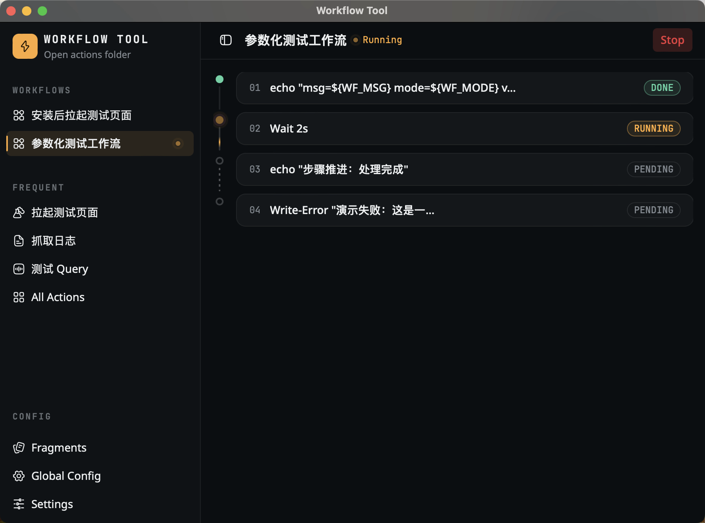

# Workflow Tool

一键触发命令/脚本/多步骤工作流的桌面工具。基于 **Wails v3 + Go + React**，YAML 声明动作与工作流，按钮触发，实时流式输出，编译为跨 macOS / Windows 单二进制。



## 核心特性

- **YAML 驱动**：在 `actions/` 放一个 `.yaml` 即新增一个动作，零代码
- **参数表单**：声明 `params`（text / bool / select / path）自动渲染表单；支持预设（presets）一键填入或直接运行
- **多步骤工作流**：`workflows/` 定义串行 step（引用 action / 内联 shell / sleep），支持 retry 和 continue_on_error
- **LLM 流式输出**：`stream: llm` 模式解析 claude stream-json，前端专用视图展示思考过程 + Markdown 回复
- **全局变量**：`config.yaml` 定义跨动作共享变量，`${VAR}` 语法在运行时替换
- **指令片段**：`fragments.yaml` 存储可复用文本片段，Tag 分类 + 变量展开 + 一键复制
- **跨平台**：macOS / Windows 单二进制，无运行时依赖
- **中英文 i18n**：界面静态文案支持切换

## 前置依赖

| 工具 | 版本 | 说明 |
|------|------|------|
| Go | 1.22+（开发用 1.26.5） | 后端编译 |
| Node.js | 18+ | 前端构建 |
| Wails CLI | `v3.0.0-alpha2.119` | 绑定生成 + 构建 |

安装 Wails CLI：
```bash
go install github.com/wailsapp/wails/v3/cmd/wails3@v3.0.0-alpha2.119
```

国内 Go 代理（可选）：
```bash
go env -w "GOPROXY=https://mirrors.aliyun.com/goproxy/,direct"
go env -w "GOSUMDB=sum.golang.google.cn"
```

## 构建

### 一键构建（推荐）

```bash
bash deploy/build.sh       # 前端 → bindings → 单二进制（平台自适应）
```

### 分步构建

```bash
bash deploy/frontend.sh    # 仅前端（自动 npm install + 生成 bindings）
bash deploy/backend.sh     # 仅后端（bindings + go build）
```

### 手动构建

```bash
# 1. 前端
cd frontend && npm install && npm run build && cd ..

# 2. 生成绑定（改 api.go 后必须重跑）
wails3 generate bindings

# 3. 编译
# macOS:
go build -o workflow-tool .
# Windows:
go build -ldflags "-H windowsgui" -o workflow-tool.exe .
```

> **顺序不能乱**：前端产物 embed 进二进制，bindings 由 api.go 生成。

## 运行

可执行文件须与 `actions/` 目录同级（启动时扫描同级 `actions/*.yaml` + `workflows/*.yaml`）：

```bash
./workflow-tool        # macOS
workflow-tool.exe      # Windows 双击
```

## 动作定义（actions/*.yaml）

```yaml
id: my-action              # ^[a-z0-9-]+$ 全局唯一
title: 我的动作
icon: hi:play              # hugeicons 图标 key，或 emoji
description: 可选描述
command:
  shell: echo hello        # 与 script 二选一
  # script: ./scripts/foo  # 按 OS 自动加 .sh/.ps1
  cwd: ${SOME_DIR}         # 可选，默认用户主目录
  timeout: 60s
  stream: ""               # "" 普通输出 | "llm" 解析 stream-json
  env:
    KEY: value
params:
  - id: URL
    label: 网址
    type: text             # text | bool | select | path
    required: true
presets:
  - name: 首页
    values: { URL: https://example.com }
```

变量替换优先级：**动作参数 > 全局配置 > 环境变量**。

> 完整字段说明见 [Action 定义指南](docs/action.md)。

## 工作流定义（workflows/*.yaml）

```yaml
id: install-and-test
title: 安装后测试
icon: hi:workflow
steps:
  - action: adb-install         # 引用已有 action
  - sleep: 5                    # 等待 N 秒
  - action: adb-debug-activity
    params: { PAGE: main }      # 覆盖 action 参数
  - shell: echo "done"          # 内联 shell
    timeout: 10s
    retry: 2
    continue_on_error: true
```

> 完整字段说明见 [Workflow 定义指南](docs/workflow.md)。

## 测试

```bash
# Go 核心包单测
go test ./internal/runner ./internal/registry ./internal/workflow

# 带竞态检测
go test -race ./...

# 前端
cd frontend && npm test
cd frontend && npm run lint && npm run typecheck
```

## 项目结构

```
workflow-tool/
├── actions/            动作定义 YAML
├── workflows/          工作流定义 YAML
├── fragments.yaml      指令片段
├── config.yaml         全局变量配置
├── scripts/            脚本文件（.sh / .ps1）
├── internal/
│   ├── runner/         Runner 接口 + ShellRunner + SleepRunner（纯 Go）
│   ├── registry/       actions + config + fragments 加载校验
│   ├── workflow/       workflow 加载、校验、串行执行
│   └── api/            Wails Service 绑定 + 事件推送
├── frontend/
│   ├── src/            React 19 + TS + Vite + Tailwind 4 + shadcn (base-ui)
│   ├── bindings/       wails3 generate bindings 产物
│   └── dist/           vite 构建产物（embed 目标）
├── deploy/             构建脚本（build.sh / frontend.sh / backend.sh）
├── docs/               文档（action.md / workflow.md / 截图 / 设计文档）
├── main.go             应用入口
└── go.mod
```

## 技术栈

| 层 | 技术 |
|----|------|
| 后端 | Go 1.26 + Wails v3 alpha2.119 |
| 前端框架 | React 19 + TypeScript + Vite 8 |
| UI | Tailwind CSS 4 + shadcn/ui (base-ui 风格) + hugeicons |
| 状态 | ActionRunnerProvider（Context + Events） |
| i18n | react-i18next |
| LLM 渲染 | streamdown + nexus-ui (Thread/Message/Reasoning) |

## 注意事项

- 锁定 Wails `v3.0.0-alpha2.119`，**不要升到 alpha.3**（绑定机制损坏）
- 改 `internal/api/api.go` 后必须重新生成 bindings
- `npm run dev` 仅能调样式，联调后端须 `go build` 跑 exe
- 新增前端文案只改 `frontend/src/i18n/locales/{zh,en}.json`
